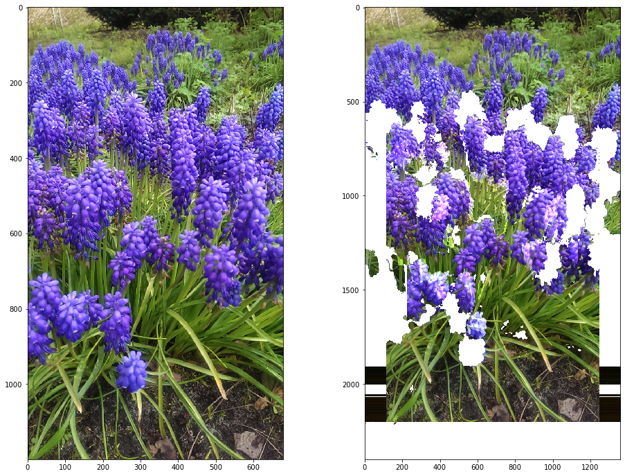

# Focal Length Shift
We try to simulate a change in focal length for an image with depth map.
Doesn't work due to occlusion.
[test.ipynb](test.ipynb)

## Future work
What you can try is to project image on an object with height defined by depth map and then simulate focal length changed with a 3D rendering engine.
